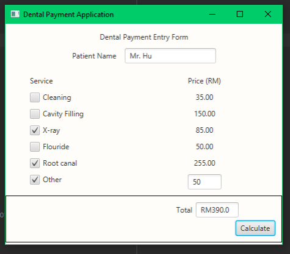
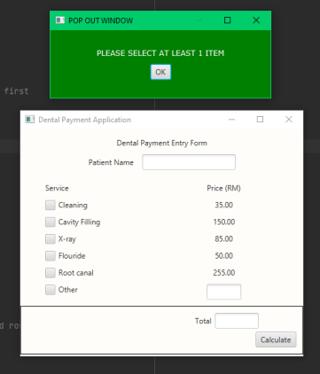

# Dental Payment Application

The Dental Payment Application is a **Java program** that implements JavaFX for its graphical user interface (GUI). This application helps to calculate the customer's bill at a dental clinic where services are priced differently based on the specific service provided.

## Features

- **JavaFX GUI**: Utilizes JavaFX to create an interactive and user-friendly interface.
- **Billing Calculation**: Calculates the customer's bill based on the services availed, each with its own pricing.
- **Customizable**: Can be extended to include additional services or pricing modifications based on clinic requirements.

## How to Use?

To run the Dental Payment Application:

1. **IDE Configuration**: Set the path for the Java SDK in your preferred IDE (e.g., IntelliJ, Eclipse).
2. **Compile the Code**: Compile the JavaFX code in your IDE.
3. **Run the Application**: Execute the compiled code to launch the Dental Payment Application.

## Screenshots

## Credits

- Developed by: **Muhammad Aliff Fikri bin Anuar Hidayat**

## Updates

- Last update: **23 June 2021**
